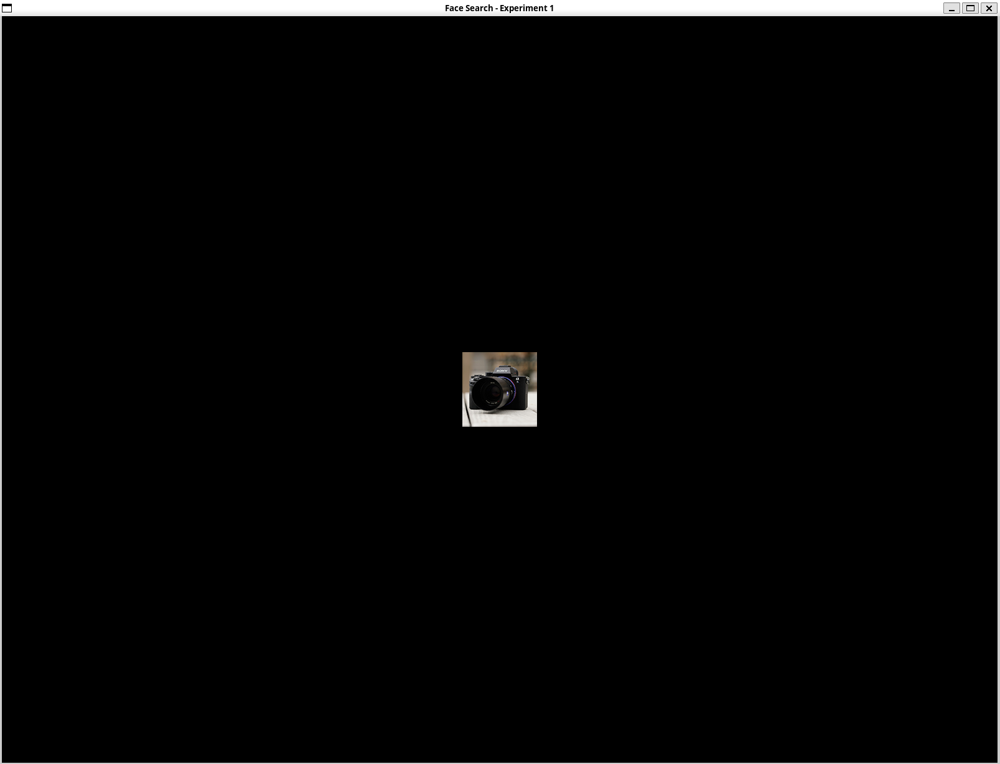
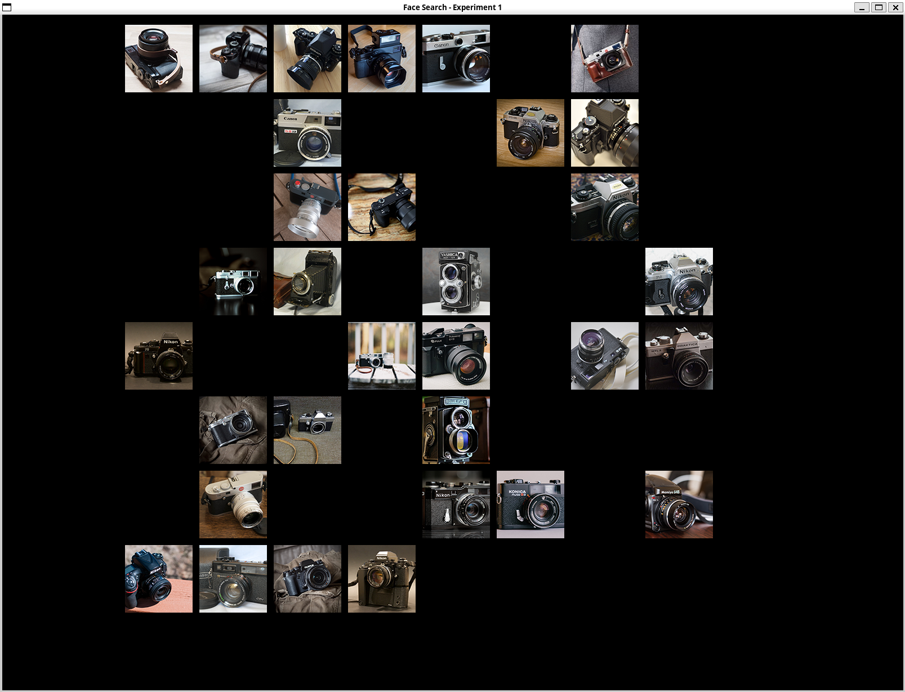
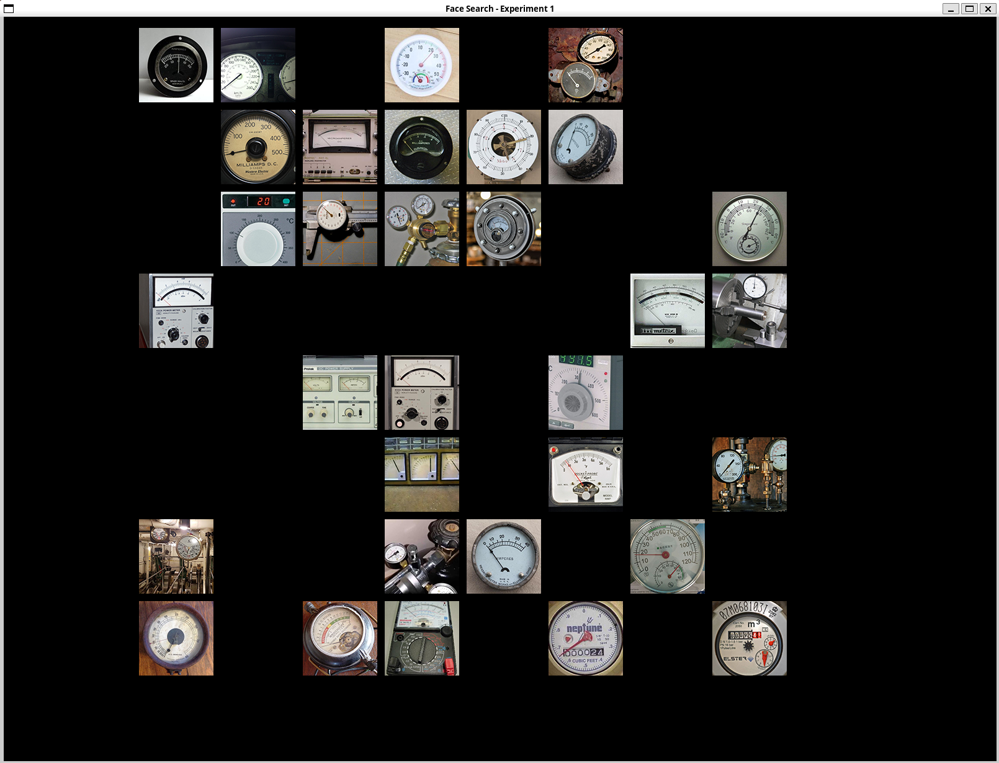
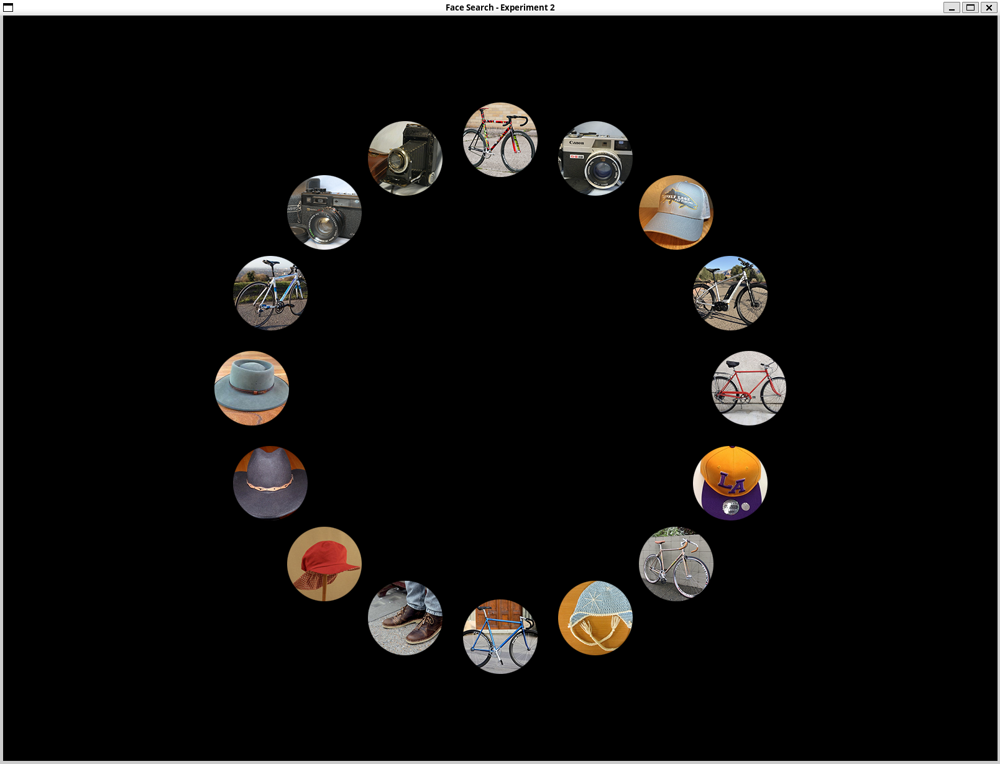

# Face Pareidolia Visual Search Task – Python Implementation

A computational reproduction of **Keys et al. (2021)** visual search paradigm investigating whether illusory faces in everyday objects confer a search speed advantage equivalent to real human faces.

## Project Overview

This project implements two visual search experiments using **Python (pygame)** to replicate the psychophysical task originally conducted with MATLAB/Psychtoolbox-3. The code maintains strict fidelity to the original experimental design while providing a portable, open-source alternative.

### Original Reference
> Keys, R.T., Taubert, J. & Wardle, S.G. A visual search advantage for illusory faces in objects. Atten Percept Psychophys 83, 1942–1953 (2021)  
> https://doi.org/10.3758/s13414-021-02267-4

## Quick Start

### Installation

```bash
# Clone or download the repository
cd "Face Perception"

# Install in development mode
pip install -e .
```

### Running the Experiments

```bash
# Experiment 1: Homogeneous distractors (8×8 grid)
face-search ex1

# Experiment 2: Heterogeneous distractors (circular layout)
face-search ex2
```

You will be prompted to enter a **Participant ID** for data tracking.

## Stimulus Materials

Stimulus materials must be downloaded from the Open Science Framework (OSF):

```
https://osf.io/rf3v6/files/osfstorage
```

After downloading, place all materials in:
```
docs/materials/
├── experiment1materials/
│   └── ex1Stimuli/
│       ├── instructions/
│       ├── practiceTrials/
│       └── stimulusCategories/
└── experiment2materials/
    └── ex2stimuli/
        ├── instructions/
        ├── practiceTrials/
        └── targetCategory/
```

**Tip:** Remove macOS metadata files:
```bash
find . -name ".DS_Store" -type f -delete
```

## Experiment Design

### Experiment 1: Grid Layout (Homogeneous Distractors)

| Parameter        | Value                              |
| ---------------- | ---------------------------------- |
| Categories       | 26 unique object types             |
| Trial Types      | 12 per category (312 total trials) |
| Set Sizes        | 16, 32, 64                         |
| Layout           | 8×8 invisible grid                 |
| Target Duration  | 1.6 s                              |
| Fixation Jitter  | 400–600 ms                         |
| Response Timeout | 15 s                               |
| Break Points     | Trials 52, 104, 156, 208, 260      |

**Factors manipulated:**
- **Target Type**: pFace (object with illusory face) vs. nonFace (matched object without face)
- **Target Presence**: Present or Absent
- **Set Size**: 16, 32, or 64 distractors (all from same object category)

#### Experiment 1 Examples

**Practice Trial - Target:**



**Practice Trial - Grid:**



**Main Trial - Target:**


**Main Trial - Grid1:**


**Main Trial - Grid2:**



### Experiment 2: Circular Layout (Heterogeneous Distractors)

| Parameter        | Value                              |
| ---------------- | ---------------------------------- |
| Categories       | 23 unique object types             |
| Trial Types      | 18 per category (414 total trials) |
| Set Sizes        | 4, 8, 16                           |
| Layout           | Equidistant circular array         |
| Target Duration  | 1.6 s                              |
| Fixation Jitter  | 400–600 ms                         |
| Response Timeout | 15 s                               |
| Break Points     | Trials 69, 138, 207, 276, 345      |

**Factors manipulated:**
- **Target Type**: nonFace, pFace, or realFace (human face)
- **Target Presence**: Present or Absent

#### Experiment 2 Examples

**Practice Trial (Circular Layout):**



**Target Presentation:**


**Search Array (Circular Layout):**


- **Set Size**: 4, 8, or 16 distractors (from diverse object categories)

## Experimental Pipeline

```
Instruction Screens
        ↓
6 Practice Trials (Set Size 32 for Ex1, 16 for Ex2)
        ↓
Main Trials (312 for Ex1, 414 for Ex2)
    For each trial:
    • Display target image (1.6 s)
    • Display fixation cross (0.4–0.6 s, randomized)
    • Display search array (until response or timeout)
    • Provide feedback (0.25 s)
        ↓
Break every 52/69/104/138... trials (6 blocks total)
        ↓
Completion Message
        ↓
Save Results
```

## Output Format

Results are saved in `output/` directory with the following structure:

```
output/
├── ex1/                           # or ex2/
│   └── [SUBJECT_ID]/
│       └── [TIMESTAMP]/
│           ├── responseData/
│           │   └── [SUBJECT_ID]_ex1_[TIMESTAMP].csv
│           ├── manifest/
│           │   └── run.json
│           └── scriptCopies/
│               └── cli.py (copy of execution script)
```

### CSV Output Columns (Ex1)

| Column                 | Description                                |
| ---------------------- | ------------------------------------------ |
| trialNumber            | Sequential trial identifier (1–312)        |
| type                   | Trial type (1–12)                          |
| stimulusCategory       | Object category (1–26)                     |
| PFstimulus             | Target type: 1=pFace, 0=nonFace            |
| setSize                | Number of distractors (16, 32, or 64)      |
| targetPresent          | 1=Present, 0=Absent                        |
| correctResponse        | 1=Correct, 0=Incorrect/Timeout             |
| rt                     | Response time in milliseconds              |
| timeoutOrKeyNotPressed | 1=Timeout (no response), 0=Normal response |
| targetYokedImageSource | Distractor image index (always 20 for Ex1) |
| targetArrayLocation    | Position of target in search array (1–64)  |

### CSV Output Columns (Ex2)

| Column                 | Description                                |
| ---------------------- | ------------------------------------------ |
| trialNumber            | Sequential trial identifier (1–414)        |
| type                   | Trial type (1–18)                          |
| stimulusCategory       | Object category (1–23)                     |
| nonFace                | 1 if target is nonFace, 0 otherwise        |
| pFace                  | 1 if target is pFace, 0 otherwise          |
| realFace               | 1 if target is realFace, 0 otherwise       |
| setSize                | Number of distractors (4, 8, or 16)        |
| targetPresent          | 1=Present, 0=Absent                        |
| correctResponse        | 1=Correct, 0=Incorrect/Timeout             |
| rt                     | Response time in milliseconds              |
| timeoutOrKeyNotPressed | 1=Timeout (no response), 0=Normal response |

## Code Architecture

### Core Modules

- **`cli.py`**: Command-line interface, argument parsing, participant ID input
- **`config.py`**: Experiment configuration (timings, set sizes, break points)
- **`trials.py`**: Trial specification generation, randomization logic
- **`stimuli.py`**: Image loading, layout computation (grid/circular), stimulus rendering
- **`runner.py`**: Main experiment loop, display management, response collection, data saving

## Response Keys

| Response               | Key(s)             |
| ---------------------- | ------------------ |
| Present (Target Found) | RIGHT arrow or 'P' |
| Absent (No Target)     | LEFT arrow or 'A'  |

## Citation

If you use this reproduction, please cite both the original paper and this implementation:

```bibtex
@article{Keys2021,
  author = {Keys, Robert T. and Taubert, Jennifer and Wardle, Stephen G.},
  year = {2021},
  title = {A visual search advantage for illusory faces in objects},
  journal = {Attention, Perception, \& Psychophysics},
  volume = {83},
  pages = {1942--1953},
  doi = {10.3758/s13414-021-02267-4}
}
```

---

For detailed technical documentation, see `docs/report/report.tex` and `docs/pre.md`.