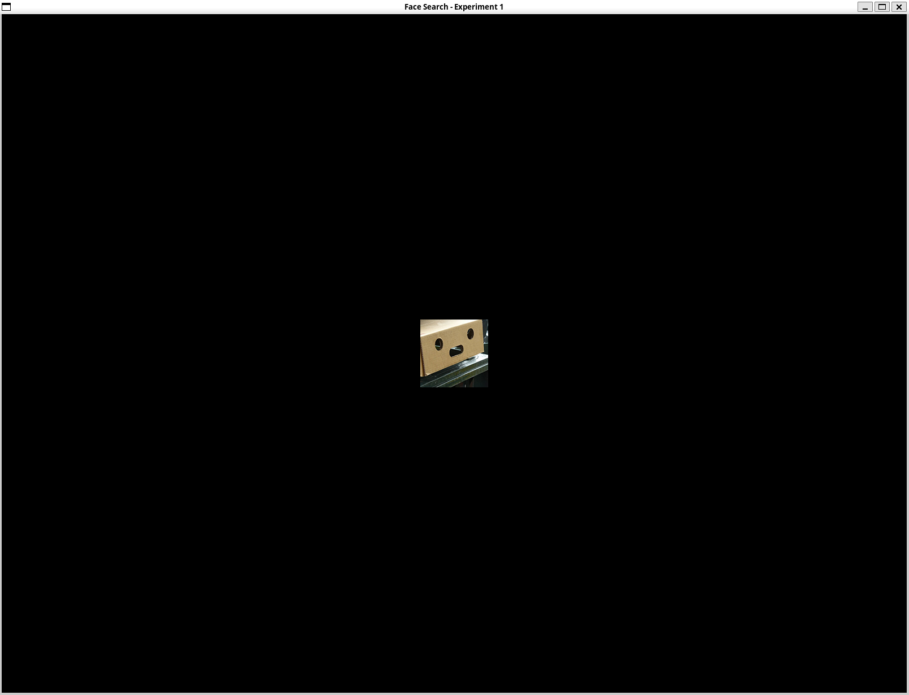
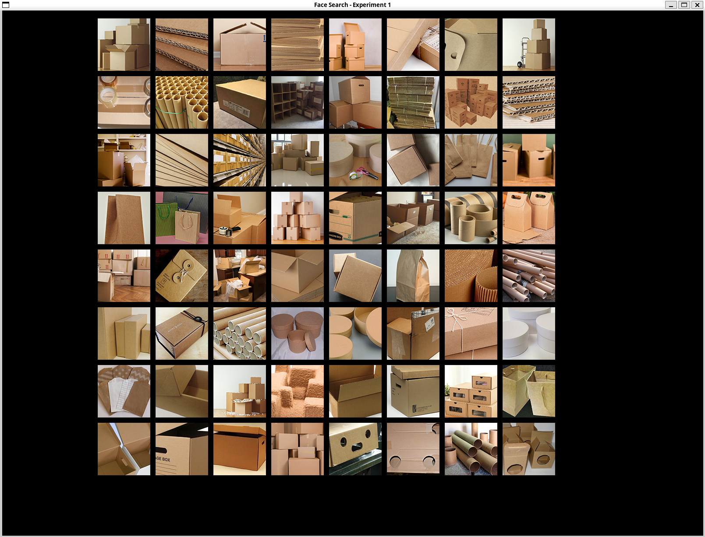
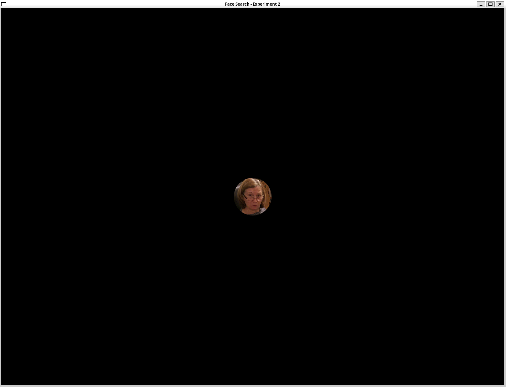
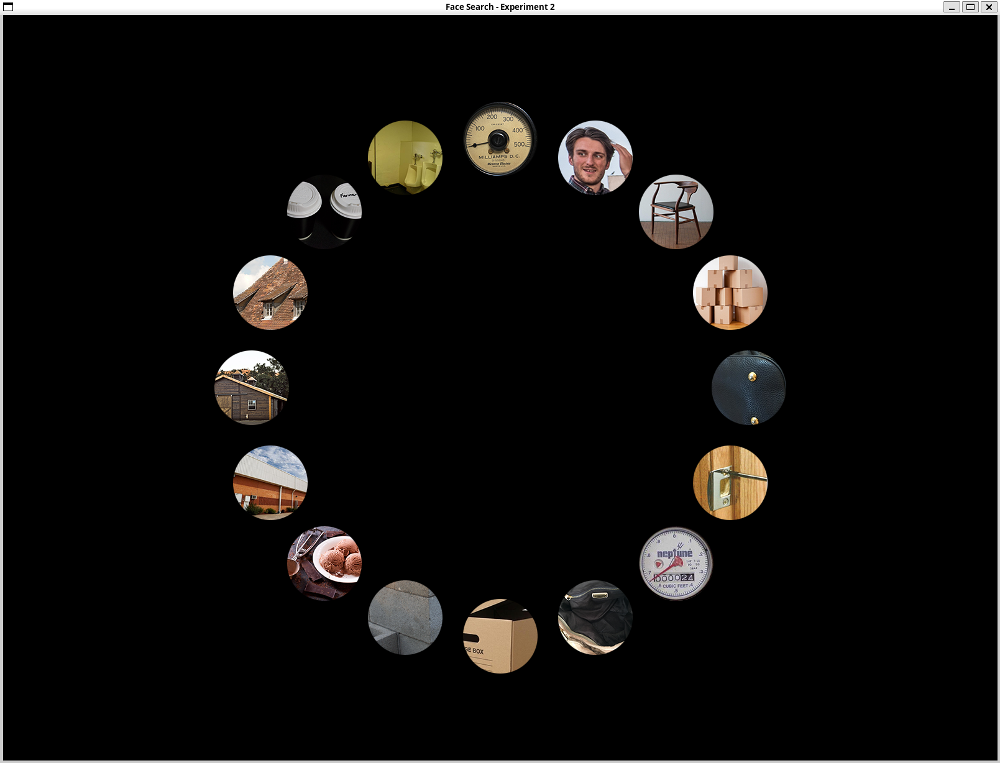
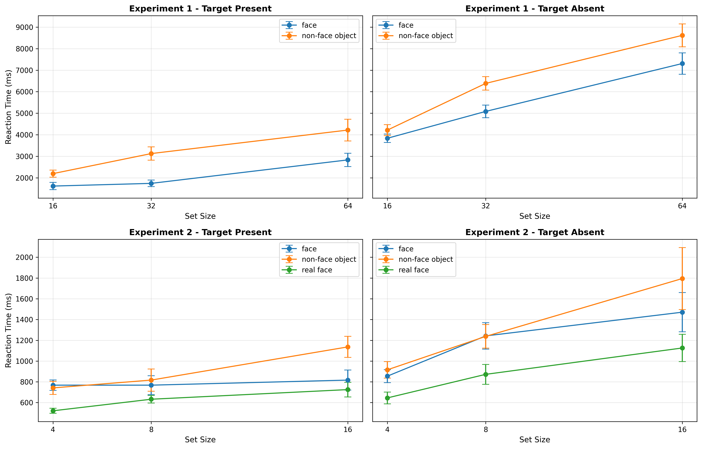
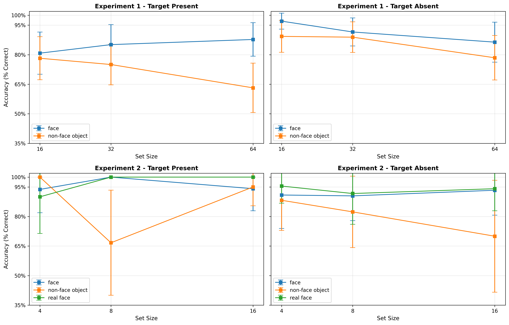
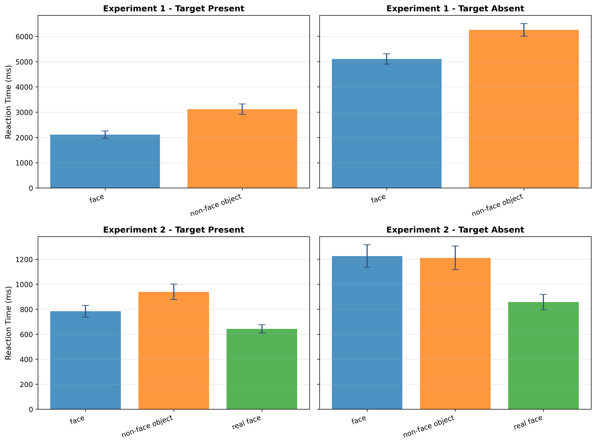
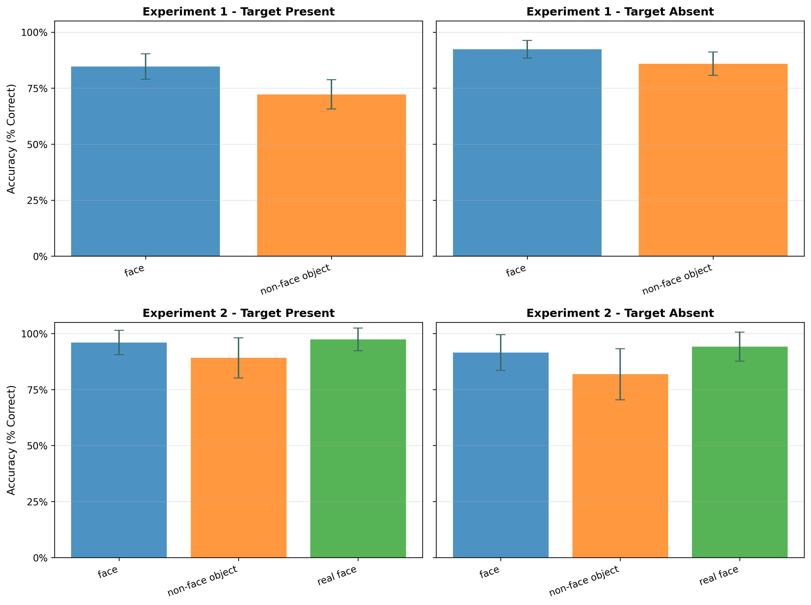
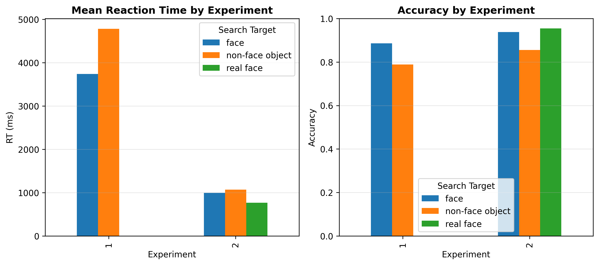

# Visual Search Advantage for Illusory Faces
## A Computational Reproduction Study

---

## Background: The Face Detection Advantage

The human visual system has evolved an extraordinary sensitivity to **faces**. 

### Key Observations

- Faces capture attention in visual clutter automatically
- We can detect a face faster than we can find an equally visible non-face object
- This happens across diverse face images (photos, drawings, schemas)

### The Paradox: Face Pareidolia

- Humans perceive faces in **inanimate objects** (clouds, toast, electrical outlets)
- These "illusory faces" lack traditional face features (skin texture, facial structure)
- Yet they still trigger rapid face-detection mechanisms

---

## The Research Question

> **Do illusory faces confer visual search speed advantage as real human faces?**

### Why This Matters

1. Tests the specificity of face-detection mechanisms
2. Reveals whether face perception depends on low-level features or high-level configuration
3. Informs theories of evolved attentional biases and evolutionary trade-offs

### Hypothesis

Face pareidolia leverages the same search advantage seen with real faces, despite lacking facial features.

---

## Experiment 1: Grid Search (Homogeneous Distractors)

**Design Goal**: Test illusory face detection among visually similar objects.

### Setup

- **Visual Layout**: Invisible 8×8 grid (64 positions max)
- **Set Sizes**: 16, 32, or 64 items
- **Stimulus Size**: 120 × 120 pixels (each image)
- **Distractors**: All from the *same object category* as the target (e.g., if target is a cheese grater, all distractors are unique cheese graters)

---


### Factors

| Factor              | Levels | Design                             |
| ------------------- | ------ | ---------------------------------- |
| **Target Type**     | 2      | pFace vs. nonFace                  |
| **Target Presence** | 2      | Present or Absent                  |
| **Set Size**        | 3      | 16, 32, or 64 distractors          |
| **Categories**      | 26     | One per participant (repeated 12×) |

### Trial Count

- 26 categories × 12 trial types = **312 trials**
- Organized into **6 blocks** (breaks every ~52 trials)

---

### Example: Ex1

|                                                                          |                                                                           |
| -----------------------------------------------------------------------: | :------------------------------------------------------------------------ |
|  |  |

---

## Experiment 2: Circular Search (Heterogeneous Distractors)

**Design Goal**: Lower task difficulty and directly compare real faces vs. illusory faces.

### Setup

- **Visual Layout**: Equidistant circular array
- **Set Sizes**: 4, 8, or 16 items
- **Stimulus Size**: 120 × 120 pixels (with circular mask)
- **Distractors**: Objects from *diverse categories*, not matching the target

---

### Factors

| Factor              | Levels | Design                                       |
| ------------------- | ------ | -------------------------------------------- |
| **Target Type**     | 3      | nonFace, pFace, or **realFace** (human face) |
| **Target Presence** | 2      | Present or Absent                            |
| **Set Size**        | 3      | 4, 8, or 16 distractors                      |
| **Categories**      | 23     | One per participant (repeated 18×)           |

### Trial Count

- 23 categories × 18 trial types = **414 trials**
- Organized into **6 blocks** (breaks every ~69 trials)

---

### Example: Ex2

|                                                                          |                                                                      |
| -----------------------------------------------------------------------: | :------------------------------------------------------------------- |
|  |  |

---

## Timing & Trial Structure

Each trial follows a **precise temporal sequence**:

```
Target Image Display
    ↓
Fixation Cross
    ↓
Search Array Display
    ↓
    Until response or 15 s timeout
    ↓
Feedback (green/red fixation)
    ↓
Inter-trial interval (black screen, ~500 ms)
```

---




---



---



---



---



---

## Observed Findings

### Experiment 1

- Main effect of **target type**: illusory faces faster than non-faces
- Main effect of **set size**: larger sets yield slower responses (visual search slopes)
- Target-absent trials slower than target-present

### Experiment 2

- Main effect of **target type**: Real Faces < Illusory Faces < Non-Faces in reaction time
- Smaller set sizes yield faster overall responses
- Target-absent trials slower than target-present

---

## Expected Findings (Cont.)

### Theoretical Implication

Search advantage for illusory faces suggests a **broadly-tuned, configural face detector**:
- Does not require low-level face features (texture, color)
- Responds to any spatial configuration resembling a "face-like" layout
- Implies evolutionary advantage of detecting any face-like configuration over missing a real face

---

## Implementation: Python + Pygame

### Why Python?

- ✅ Cross-platform compatibility (Windows, macOS, Linux)
- ✅ Open-source (no proprietary software dependency)
- ✅ Precise timing via `pygame` for response collection
- ✅ Reproducible data collection with random seed control

---

### Key Technical Features

1. **Stimulus Yocking** (Ex1):
   - All distractors sourced from same category as target
   - Ensures homogeneous visual context

2. **Circular Layout** (Ex2):
   - Equidistant positions computed trigonometrically
   - Stimulus mask applied to enforce circular presentation

---

### Key Technical Features (Cont.)

3. **Deterministic Randomization**:
   - Category order avoids adjacent repeats
   - Trial type order randomized within each category
   - Reproducible via random seed storage

4. **Data Recording**:
   - Response times to millisecond precision
   - Trial order saved for full reproducibility
   - JSON manifest + CSV output for analysis

---

## Data Analysis Pipeline

```
Raw CSV Output
    ↓
Correctness Filtering (remove timeout errors)
    ↓
Reaction Time Analysis
    • ANOVA: Target Type × Set Size × Target Presence
    • Planned contrasts: pFace vs. nonFace; realFace vs. pFace
    • Visual search slopes (RT vs. Set Size)
    ↓
Accuracy Analysis
    • Conditional error rates by target type
    ↓
Visualization
    • Line plots: RT vs. Set Size (by target type)
    • Bar plots: RT and accuracy comparisons
```

---

## Conclusion: Implications for Face Perception

### What This Tells Us

1. **Configurational Face Detection**: Humans possess a face-detection system tuned to *spatial configuration*, not low-level features.

2. **Evolutionary Hypothesis**: This broad tuning reflects an adaptive trade-off—the cost of false positives (pareidolia) is negligible compared to missing a real face in social or threat contexts.

3. **Neural Substrates**: Illusory face detection likely engages similar neural populations (fusiform face area, amygdala) as real face detection.

---

## Thank You!

**Questions?**

This reproduction demonstrates that illusory face detection is indeed a genuine visual search advantage, supporting decades of face perception research through computational replication.
